**DESCRIPCION GENERAL DEL PROYECTO**

El proyecto se trata de un control de temperatura para hornos de cerámica a través de un ESP32 y una app.

La infraestructura se compone del ESP32 para gestión de la temperatura, una app que corre en dispositivos móviles y la comunicación es a través de BLE (si existe cercanía entre el horno y el móvil) y Firebase, si existe conexión a internet.

La lectura de temperatura del horno se realiza a través de una termocupla y un MAX31855 y el control de encendido a través de un relé de estado sólido.

**ARQUITECTURA : ESP32 + Firebase + BLE + App android**

`	`ESP32 

Proceso inicial. Vinculación con la app:

El dispositivo debe vincularse con la app a través de BLE.

En la app el usuario debe dar de alta el horno (dispositivo vinculado) ingresando

- Nombre del horno
- Modelo
- Volumen

Una vez dado de alta, desde la app se deben enviar credenciales (nombre de la red y contraseña) para el acceso del horno a internet a través de una red WiFi. 

Actualización de datos:

El ESP32 actualiza cada 3 segundos información de 

- temperatura, 
- estado del horno, 
- hora epoch, 
- hora de inicio de la horneada
- etapa del proceso de horneado

Esta información se actualiza en la nube (Firebase) y en forma directa a la app si el dispositivo móvil está cerca y conectado.

Proceso de horneado

El ESP32 puede recibir solo a través de BLE la información correspondiente al programa de horneado. La misma consta de una sucesión de etapas. Cada una con 3 parámetros:

- Temperatura objetivo (grados centígrados)
- Velocidad de la etapa (\*C/min)
- Meseta (min)

`	`APP

`	`La app debe vincularse y con el ESP32 a través de una conexión BLE y conectarse a Firebase en el caso de disponer acceso a internet.

La conexión directa con el ESP32 se utiliza para enviar la información del programa de cocción seleccionado y la instrucción de comenzar el proceso de horneado.

También se utiliza para recibir información Realtime del dispositivo (temperatura, estado del horno, etc).

La app debe estar chequeando la cercanía con el horno e intentar iniciar la comunicación. De este modo, en el caso de no tener WiFi disponible, el usuario igualmente puede visualizar parámetros del proceso en curso, o simplemente la temperatura del horno.

Si la app no puede conectar con el ESP32, el acceso a la información del horno puede realizarla a través de internet, accediendo a Firebase. 

Detección y lógica de comunicación de la app:

- Si hay dispositivo vinculado cercano → app intenta autoconectar y usar BLE para recibir información Realtime del horno. 
- Si no hay dispositivo vinculado cercano pero hay Internet → app usa Firebase para acceder a la información.
- Si no hay ninguna → mostrar modo sin conexión

**EPECIFICACIONES TECNICAS DE LA APP**

- Lenguaje: Android
- Versión mínima: Android 7.0 / API24.
- Lenguaje de desarrollo: Kotlin
- Arquitectura interna: (MVVM con ViewModel + LiveData o Jetpack Compose
- Librerías recomendadas:
  - Firebase SDK (Auth + Realtime Database).
  - Librería BLE estable (ej. Nordic Semiconductor Android BLE Library).
  - Librería para gráficos (MPAndroidChart o Compose Charts).
  - Room DB para cache local offline.

**LOGICA DEL SISTEMA**

**ESP32**: mide temperatura, controla relés, y actualiza el estado del horno y las variables de programa en firebase/app si está conectado por BLE.

**Firebase**: base de datos en tiempo real en la nube que sincroniza app y horno.

**BLE**: datos de la curva/programa a ejecutar. Temperatura y estado del horno en tiempo real si el horno y la app están conectados.

**App móvil**: permite ver temperatura actual, iniciar/parar curvas, ver el historial de horneadas. Configura red de WiFi y password en el ESP32, permite programar curvas y agregar hornos.

**LOGICA DE COMUNICACIÓN**

BLE

- Se usa solo en cercanía.
- Obligatorio para enviar programas al horno.
- Proporciona temperatura y estado en vivo.

FIREBASE

- Guarda historial, perfiles y estado del horno.
- Permite monitoreo remoto (si horno y móvil tienen internet).

FALLBACK

- App siempre intenta:
  - BLE (si horno cercano).
  - Firebase (si hay internet).
  - Últimos datos almacenados (si no hay conexión).

**COMPORTAMIENTO ESPERADO DE LA APP**

- Debe detectar automáticamente si hay un horno cercano y conectarse por BLE sin pedir acción manual.
- Debe funcionar offline:
  - El usuario puede ver hornos guardados y curvas incluso sin internet.
- Sincronización diferida:
  - Si se crean curvas offline → se guardan local y suben a Firebase cuando vuelva el WiFi.
- Seguridad:
  - Acceso a datos solo con cuenta de usuario.
  - Cada horno está vinculado a una cuenta (MAC como ID único).

**COMPONENTES NECESARIOS**

- ESP32 Microcontrolador Wi-Fi / BLE.
- Sensor de temperatura Termocupla tipo K + MAX31855
- Relé SSR Control de resistencias del horno eléctrico
- Firebase Realtime Database Base de datos principal en la nube (en tiempo real)
- Firebase Authentication Para acceder en forma segura (con login opcional)
- App Android Interfaz para usuario final

**FLUJO PRINCIPAL DE LA APP**

Inicio de sesión y registro

- Pantalla de presentación con opción de:
  - Sign up → Registro en Firebase (correo + contraseña).
  - Login → Ingreso con credenciales.
  - Opción “Recuérdame” para entrar directo sin volver a pedir login.
- Credenciales deben guardarse localmente para funcionar sin internet.

Pantalla inicial (Home)

- Si no hay hornos registrados → mensaje “Ready to start?” + botón para buscar hornos vía BLE.
- Si ya hay hornos registrados → lista de hornos disponibles (nombre, estado, última conexión, temperatura básica).

Alta de un horno (dispositivo nuevo)

- App escanea por BLE.
- Usuario selecciona el horno → ingresa:
  - Nombre, modelo, volumen.
- App envía credenciales de WiFi al ESP32.
- ESP32 confirma alta y guarda en Firebase cuando esté online.

Programación de curvas

- El usuario diseña curvas (perfiles de horneada).
- Cada curva se compone de segmentos con:
  - Temperatura objetivo.
  - Velocidad (°C/min).
  - Tiempo de meseta.
- Curvas se guardan en el móvil y se sincronizan con Firebase si hay internet.

Inicio de horneada

- Usuario se acerca al horno → la app detecta BLE.
- Se selecciona un perfil de curva y se envía al ESP32.
- Se inicia el proceso de horneado.
- El horno transmite estado y temperatura en tiempo real (BLE si cerca, Firebase si remoto).

Monitoreo

- Si hay BLE activo → datos en tiempo real.
- Si no hay BLE pero hay internet → datos desde Firebase.
- Si no hay conexión → modo sin conexión (mostrar última info disponible).

Historial

- La app consulta en Firebase o localmente:
  - Fechas de horneadas.
  - Perfiles usados.
  - Temperaturas máximas alcanzadas.
  - Estados finales (Finalizado, Detenido, Error).
  - Gráfica de evolución de temperatura.

**

**ACTIVIDADES DE LA APP**

- PRESENTACION / LOGIN / SIGNUP

  La app inicia con una pantalla de presentación invitando al usuario a ingresar con una cuenta (registro existente) o darse de alta con una cuenta (que será utilizada para acceder a Firebase).

  Si se presiona el botón *GET STARTED*, la app lo redirige a la pantalla SIGN UP para que complete correo electronico y contraseña (2 veces para validar). Con estas credenciales, la app debe registrar al usuario en Firebase para luego poder acceder a información en la nube. El usuario (correo electrónico) y contraseña también deben quedar registrados en el dispositivo móvil ya que el acceso a la app no debe depender de internet (Firebase).

  En el caso que el botón de *I HAVE AN ACCOUNT* sea presionado, la app redirige a la pantalla de LOGIN, donde el usuario debe ingresar dirección de correo electrónico y contraseña válidos para acceder.

  Existe un check box REMIND ME, y en el caso de estar activado y que el usuario ya haya ingresado con credenciales validas se accede directo a la siguiente pantalla/actividad de la app.

|**PRESENTACION**|**LOGIN**|**SIGN UP**|**SIGN UP**|
| :-: | :-: | :-: | :-: |
|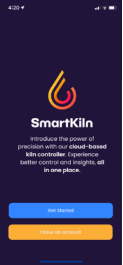|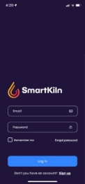|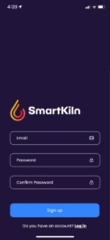|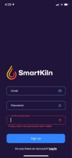|

- INICIO

  En todos los casos se accede a una pantalla con un menú de navegación en la parte inferior de la misma.

  El menú consta de 4 secciones y un botón circular central con el signo +. Las secciones del menú son :

  - Hornos
  - Programas
  - Historial
  - Configuración 

Cuando se accede a la app por primera vez, o aun no hay hornos (dispositivos ESP32) dados de alta en la misma, la pantalla de inicio está vacía, con una leyenda “Ready to start?”(#INICIO s/hornos)  y un botón de *INICIO*, para dar comienzo al escaneo bluetooth (low energy) en búsqueda de dispositivos cercanos. Del mismo modo, se puede iniciar el scaneo de nuevos hornos presionando el botón + y seleccionando la opción “Nuevo Horno”

La app debe iniciar un escaneo de dispositivos cercanos.

Si ya existen hornos vinculados que han sido dados de alta en la app, lo que aparece en la actividad de inicio es un listado de los hornos disponibles, con información básica de los mismos (#INICIO c/hornos).

- AGREGAR PRIMER HORNO

  Al presionar el botón START (en el caso de que no existan hornos vinculados disponibles) la app inicia un proceso de búsqueda de dispositivos cercanos para conectar a través de BLE (#SEARCHING NEW KILN).

  Si no se encuentra ningún dispositivo disponible o el dispositivo móvil no se encuentra a una distancia para poder vincularse, despliega mensaje indicando la situación al usuario (#NO DEVICES FOUND)

|**#INICIO s/hornos**|**#SEARCHING NEW KILN**|**#NO DEVICES FOUND**|**#DEVICES FOUND**|
| :-: | :-: | :-: | :-: |
|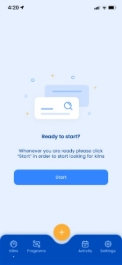|![ref1]|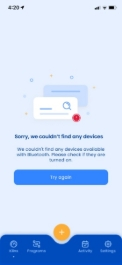|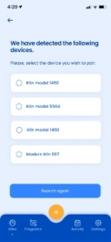|

En el caso de encontrar dispositivos, de despliega un listado detallando las opciones (#DEVICES FOUND).

El usuario debe entonces, seleccionar el horno deseado para iniciar el proceso de alta de dispositivo (horno) en el cual debe ingresar el nombre a asignar al horno, el fabricante y el volumen interno del mismo (#INPUT KILN).

Estos datos deben ser almacenados en la memoria interna del dispositivo movil y actualizados en FIREBASE.

|**#SELECTED DEVICE**|**#INPUT KILN**|**#KILN ADDED**|**#KILN ADDED FAIL**|
| :-: | :-: | :-: | :-: |
|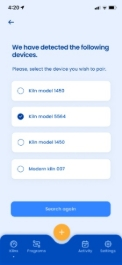|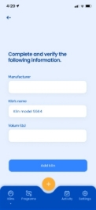|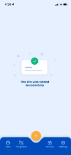|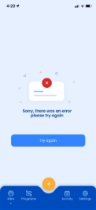|

Luego de concluir la accion, la app muestra una pantalla de incorporación exitosa o fallida del horno.

- AGREGAR NUEVO HORNO 

  Al presionar el botón + en el menú de navegación, la app despliega opción consultando al usuario si lo que desea añadir es un horno, o un nuevo programa (#NEW KILN/PROGRAM). En el caso de seleccionar “nuevo horno”, comienza la búsqueda de dispositivos cercanos y continúa el proceso de igual modo que al agregar el primer horno .

|||||
| :-: | :-: | :-: | :-: |
|**# NEW KILN/PROGRAM**|**#SEARCHING NEW KILN**|||
|![ref2]|![ref1]|||

- AGREGAR PROGRAMA

  Un programa consiste en de una secuencia de etapas de cocción, compuestas por una temperatura objetivo (\*C), una velocidad de incremento de temperatura (\*C/min) y una meseta de mantenimiento de temperatura (min).

  Al presionar el botón +, la app despliega opción consultando al usuario si lo que desea añadir es un horno, o un nuevo programa. En el caso de presionar sobre Nuevo Programa, se inicia una nueva actividad que no dispone de la barra de navegación inferior y solicita al usuario que ingrese el nombre a asignarle.

|**# NEW KILN/PROGRAM**|**#CREATE PROGRAM**|**#INPUT STAGE**|**#ADD STAGE**|
| :-: | :-: | :-: | :-: |
|![ref2]|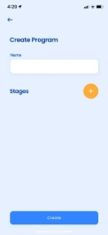|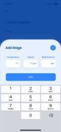|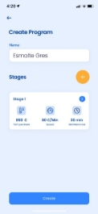|

El usuario debe ingresar los 3 parámetros (temperatura, velocidad y meseta) para cada etapa del programa.

Luego de ingresar los datos de la etapa, debe presionar el botón “Agregar” (#INPUT STAGE).

Para agregar mas etapas se presiona el botón + y se incorporan tantas etapas como sean necesarias.

Esta información debe almacenarse localmente y actualizar en la nube (Firebase).

- LISTADO Y EDICION PROGRAMAS

  Al presionar “Programas” en la barra de navegación, la app muestra el listado de programas de cocción disponibles en memoria.

  Si no hay programas previamente almacenados, advierte al usuario (#NO PROGRAM), o muestra el listado de programas ya cargados con algunos detalles de cada uno (Nombre del programa, temperatura máxima, duración) (#PROGRAM LIST).

  Al presionar sobre un programa moviéndolo hacia la izquierda, se muestra la opción de editar o eliminar el programa seleccionado (#EDIT/DELETE PROGRAM).

  Si se presiona el botón “delete” el programa se elimina de memoria y se actualiza Firebase.

  En el caso de presionar el icono “edit” se inicia una nueva actividad sin el menú de la barra inferior, donde se detalla el nombre del programa seleccionado y las etapas que lo componen. El usuario puede presionar dentro del box de nombre para poder editarlo o presionar sobre la etapa deseada moviéndola hacia la izquierda donde tendrá la oportunidad de definir si lo que desea es editar o eliminar la etapa seleccionada. (# EDIT/DELETE STAGE)

|**#NO PROGRAM**|**#PROGRAMS LIST**|**#EDIT/DELETE PROGRAM**|**#EDIT/DELETE STAGE**|
| :-: | :-: | :-: | :-: |
|
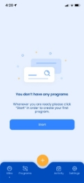

|![ref3]|![ref4]|![ref5]|
|**#EDIT STAGE**||||
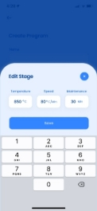Una vez seleccionada la etapa, se despliega una pantalla equivalente al ingreso de datos de etapa, sin barra de navegación inferior, con la información pre cargada y editable de la etapa seleccionada. (#EDIT STAGE).

El usuario puede moverse entre los 3 box disponibles (temperatura objetivo, velocidad y mantenimiento) para realizar los ajustes necesarios. Luego presiona el botón “Guardar” para regresar el menú con detalle del programa (# EDIT/DELETE STAGE) donde podrá seguir editando de ser necesario, o guardar cambios para proceder a almacenar los ajustes realizados.

- DETALLE DE ACTIVIDAD

|**#KILN ACTIVITY**||||
| :-: | :-: | :-: | :-: |
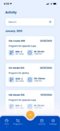Al presionar “Actividad” en la barra de navegación, la app muestra el listado de actividad del horno detallando los programas ejecutados en cada horno, ordenados por fecha. (#KILN ACTIVITY)

En la tarjeta de cada actividad se detalla nombre del horno, fecha de ejecución del programa, nombre del programa ejecutado, temperatura máxima y duración total del proceso. 

- INICIAR PROGRAMA

  Para iniciar un programa de cocción se debe presionar la opción “hornos” en la barra de navegación que es la pantalla “home” de la app. En la misma se detallan los hornos disponibles (vinculados) a la app mediante una tarjeta con datos básicos de cada uno (nombre, temperatura, estado del horno, estado de la conexión a WiFi y BT)

|**#KILN LIST**|**#PROGRAMS LIST**|**#EDIT/DELETE PROGRAM**|**#EDIT/DELETE STAGE**|
| :-: | :-: | :-: | :-: |
|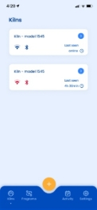|![ref3]|![ref4]|![ref5]|

- CONFIGURACION/SETTINGS

  Al presionar “Settings” en la barra de navegación, la app muestra el detalle de la cuenta (#SETTINGS).

  Esto incluye los datos de usuario, lenguaje, unidad de medida y detalles de la conexión a WiFi, necesarios para configurar el horno (ESP32)

  Al presionar sobre la tarjeta de WiFi la app lista las redes disponibles (#NETWORK LIST). Al seleccionar la red sobre la cual se desea opere el horno, se solicita al usuario que ingrese la contraseña correspondiente (#WiFi PASSWORD) y presionar el botón “SEND” para enviar las credenciales al dispositivo ESP32.

|**#SETTINGS**|**#NETWORK LIST**|**#WiFi PASSWORD**|**#WiFi CREDENTIALS SEND**||
| :-: | :-: | :-: | :- | :- |
|
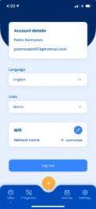

|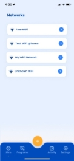|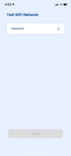|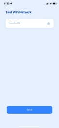||

FLUJO DE TRANSMISION DE PROGRAMA DE HORNEADO

- Usuario diseña curva en la app.
- Se guarda en el dispositivo móvil y hace backup en Firebase cuando exista conexión a wifi disponible.
- Usuario se acerca al horno.
- La app escanea y se conecta por BLE.
- El usuario selecciona un programa y lo envía al ESP32.
- El horno comienza la cocción con ese programa.
- El ESP32 puede publicar su temperatura y estado en Firebase (si tiene Wi-Fi).
- La app monitorea en vivo (por Firebase o BLE si se mantiene cerca).

**PALETA DE COLORES**

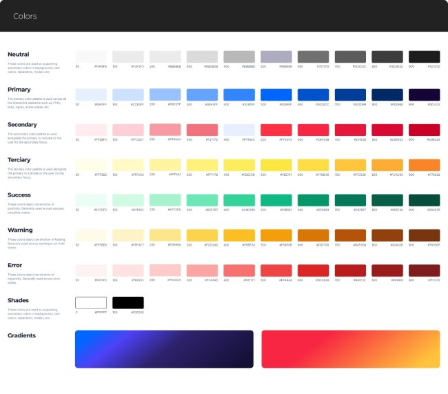

ICONOS

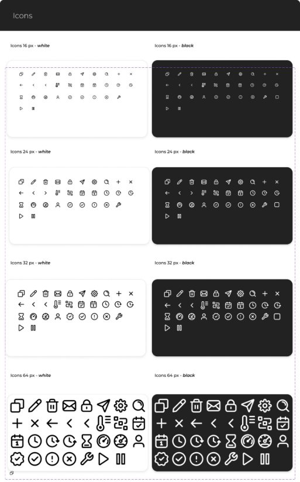

TIPOGRAFIA

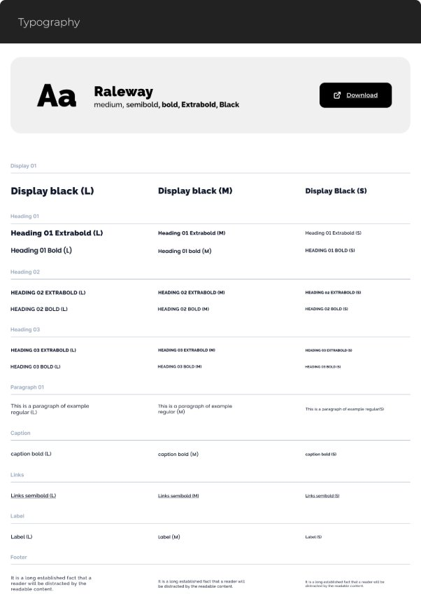

ESTRUCTURA DE DATOS DE FIREBASE

/users/{userId}/

├── profile/

` `│   ├── name: "Usuario"

` `│   ├── email: "user@email.com"

` `│    └── createdAt: timestamp

` `└── kilns/

`    `└── {macAddress}/  // MAC como ID único

`        `├── deviceInfo/

`         `│   ├── name: "Mi Kiln Cerámico"

`         `│   ├── macAddress: "AA:BB:CC:DD:EE:FF"

`         `│   ├── model: "SmartKiln - Ceramica"

`         `│   ├── lastSeen: timestamp

`         `│    └── isOnline: boolean

`        `├── currentSession/

`         `│  ├── status: "IDLE" | "CALENTANDO" | "PAUSADO" | "DETENIDO" | "FINALIZADO"

`         `│  ├── temperature: 180.5

`         `│  ├── targetTemperature: 200.0

`         `│  ├── currentSegment: 2

`         `│  ├── totalSegments: 5

`         `│  ├── timeRemaining: 3600

`         `│  ├── startTime: timestamp

`         `│   └── activeProfile: "Curva Básica"

`        `├── profiles/  // Curvas privadas del usuario

`         `│   └── {profileId}/

`         `│      ├── name: "Curva Básica"

`         `│      ├── description: "Para cerámica básica"

`         `│      ├── segments: [

`         `│       │   {

`         `│       │     tempObjetivo: 200,

`         `│       │     rampaCporMin: 50,

`         `│       │     tiempoRemojoMin: 30

`         `│       │   }

`         `│       │ ]

`         `│      ├── createdAt: timestamp

`         `│       └── isDefault: boolean

`         `└── history/

`             `└── {sessionId}/

`                 `├── startTime: timestamp

`                 `├── endTime: timestamp

`                 `├── duration: 3600

`                 `├── maxTemperature: 200.0

`                 `├── profileUsed: "Curva Básica"

`                 `├── finalStatus: "FINALIZADO" | "DETENIDO" | "ERROR"

`                  `└── dataPoints/  // Cada 5 minutos

`                    `├── 0: { timestamp: 1234567890, temperature: 180.5, targetTemp: 200.0, segment: 1 }

`                    `├── 1: { timestamp: 1234568190, temperature: 190.2, targetTemp: 200.0, segment: 1 }

`                      `└── ...

[ref1]: Aspose.Words.ece6442e-00ae-47ca-9d4c-02f5c221b167.006.jpeg
[ref2]: Aspose.Words.ece6442e-00ae-47ca-9d4c-02f5c221b167.013.jpeg
[ref3]: Aspose.Words.ece6442e-00ae-47ca-9d4c-02f5c221b167.018.jpeg
[ref4]: Aspose.Words.ece6442e-00ae-47ca-9d4c-02f5c221b167.019.jpeg
[ref5]: Aspose.Words.ece6442e-00ae-47ca-9d4c-02f5c221b167.020.jpeg
